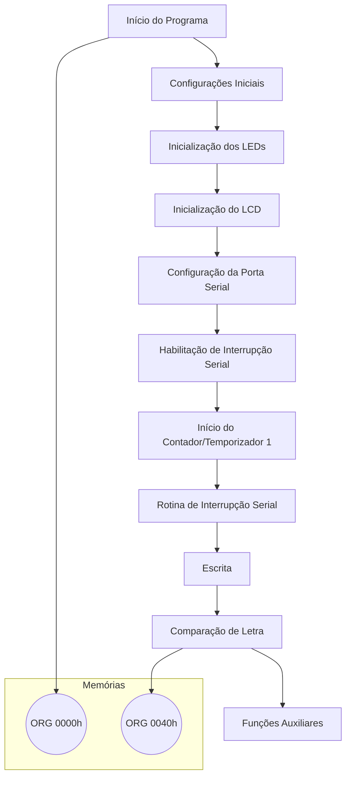

Este projeto consiste em um jogo da forca implementado em assembly. O jogo desafia os jogadores a descobrir uma palavra oculta, tentando adivinhar as letras corretas antes de exceder o número limite de tentativas.

## 📈 Objetivo 📈
O jogador deverá adivinhar a palavra que está armazenada na memória sem perder as vidas que ele tem. 

## 📚 Itens Utilizados 📚

### Tecnologias 👾


### Materiais 🖌️

<div>
  <ul>
    <li>edSim 51</li>
    <li>Display LCD 16x2</li>
  </ul>
</div>

### Fluxograma 🔄



## 🖥️ Código do Projeto 🖥️

O código também está disponível no repositório!

```asm

```

## 🕹️ Passo a Passo do Jogo 🕹️

- Assim que o jogo iniciar, o jogador deve inserir uma letra no UART e enviar.
- Caso tenha a letra na palavra, ela será inserida na primeira fileira.
- Caso não tenha a letra na palavra, ela será mostrada na segunda fileira e uma vida será perdida.
- O jogador deverá descobrir a palavra escondida sem perder todas as vidas.
- Caso não consiga, o jogo será finalizado.

## 🧑🏻‍💻 Autores do Projeto 🧑🏻‍💻

#### Anna Carolina Zomer ⬇️
[](https://github.com/z0mer)

#### Humberto Pellegrini ⬇️
[](https://github.com/Humbertin07)


