<p align="center">
  <a href="#%EF%B8%8F-passo-a-passo-do-jogo-%EF%B8%8F">Passo a Passo</a> |
  <a href="#-objetivo-">Objetivo</a> |
  <a href="#-itens-utilizados-">Itens Utilizados</a> |
  <a href="#%EF%B8%8F-código-do-projeto-%EF%B8%8F">Código do Projeto</a> |
  <a href="#-autores-do-projeto-">Autores</a>
</p>

Este projeto consiste em um jogo da forca implementado em assembly. O jogo desafia os jogadores a descobrir uma palavra oculta, tentando adivinhar as letras corretas antes de exceder o número limite de tentativas.

## 📈 Objetivo 📈
O jogador deverá adivinhar a palavra que está armazenada na memória sem perder as 08 vidas que ele tem. 

## 🕹️ Passo a Passo do Jogo 🕹️

- Assim que o jogo iniciar, o jogador deve inserir uma letra no UART e enviar.
- Caso tenha a letra na palavra, ela será inserida na primeira fileira.
- Caso não tenha a letra na palavra, ela será mostrada na segunda fileira e uma vida será perdida.
- O jogador deverá descobrir a palavra escondida sem perder todas as vidas.
- Caso não consiga, a palavra "FRACASSO" aparecerá no LCD e o jogo será finalizado.
- Caso consiga, a palavra "YOU WIN!" aparecerá no LCD e o jogo será finalizado.

## 📚 Itens Utilizados 📚

### Tecnologias 👾


### Materiais 🖌️

<div>
  <ul>
    <li>edSim 51</li>
    <li>Display LCD 16x2</li>
    <li>8-bit UART</li>
  </ul>
</div>

### Fluxograma 🔄

```mermaid
graph TD;

start([START])
LCD[[lcd_init]]
ROM[[escreveStringROM]]
cursor[[posicionaCursor]]
display[[clearDisplay]]
compara[[comparaLetra]]
send[[sendCharacter]]
aoba[FORCA]
r1[R1 = #00h]
r3[R3 = #00h]
r3f[R3 = #0FFh]
jmp[JMP $]
loop{loopComparacao}
verifica{verificaProximo}
fimcomp{fimComparacao}
r7[R7 = 8]
r7f{R7 = 0}
r5[R5 = tamanho da palavra]
fraco[FRACASSO]
ganhar[YOU WIN!]
sjmp[SJMP $]

start-->LCD-->cursor--->|primeiro passo|aoba
aoba-->ROM-->r1-->display-->jmp
jmp--->|entra letra UART - loop|compara
compara-->loop--->|vai e volta|verifica--->|até acabar a palavra|loop
verifica--->|letras corretas|cursor--->|imprime na primeira linha as letras correspondentes|send
send--->|espera uma nova letra no UART|jmp
loop--->|acabou a palavra|fimcomp-->r3--->|letras erradas e decrementa 1 ponto|cursor
cursor--->|imprime na segunda linha as letras não correspondentes|send
fimcomp-->r3f--->|decrementa R5 até 0 a cada letra acertada|display-->cursor-->ROM--->|imprime no LCD|ganhar
ganhar--->|limpa o LCD para finalizar o jogo|display-->sjmp
cursor--->|imprime no LCD a pontuação|r7-->fimcomp
r7-->r7f-->display-->cursor-->fraco-->ROM-->display-->sjmp


```



## 🖥️ Código do Projeto 🖥️

O código também está disponível no repositório!

<details>
  <summary>Código em Assembly</summary>

  ```asm
RS      EQU     P1.3
EN      EQU     P1.2

ORG 0000h ; espaço para variáveis

ORG 0000h
    LJMP START

ORG 023H ; PONTEIRO DA INTERRUPCAO PARA CANAL SERIAL
    MOV A,SBUF ; REALIZA A LEITURA DO BYTE RECEBIDO
    MOV @R0, A
    CLR RI
    INC R0
    CJNE A, #0Dh, escreve
    RETI

escreve:
    MOV 30h, A ; ESCREVE O VALOR NO ENDEREÇO 30H
    ;CLR RI ; RESETA RI PARA RECEBER NOVO BYTE
    SETB F0
    ACALL comparaLetra ; Adicionado chamada para comparaLetra aqui
    RETI

ORG 0080h
AOBA:
    DB "FORCA"
    DB 00h

PALAVRA:
    DB "TESTE"
    DB 00h

FRACASSO:
    DB "FRACASSO"
    DB 00h

VENCEDOR:
    DB "YOU WIN!"
    DB 00h

START:
    ACALL lcd_init
    MOV SCON, #50H ;porta serial no modo 1 e habilita a recepção
    MOV PCON, #80h ;set o bit SMOD
    MOV TMOD, #20H ;CT1 no modo 2
    MOV TH1, #243 ;valor para a recarga
    MOV TL1, #243 ;valor para a primeira contagem
    MOV IE,#90H ; Habilita interrupção serial
    SETB TR1 ;liga o contador/temporizador 1 
    MOV R5, #05h
    MOV R7, #08h
    MOV A, #05h
    ACALL posicionaCursor
    MOV DPTR,#AOBA          
    ACALL escreveStringROM
    ACALL clearDisplay
    MOV A, #4Fh
    ACALL posicionaCursor
    MOV 70h, R7
    MOV A , 70h
    ADD A, #30h
    ACALL sendCharacter
    MOV R4, #40h
    JMP $    

escreveStringROM:
    MOV R1, #00h  

loop:
    MOV A, R1
    MOVC A, @A + DPTR
    JZ  finish  
    ACALL sendCharacter  
    INC R1
    JMP loop
finish:
    RET

comparaLetra:
    MOV DPTR, #PALAVRA ; aponta DPTR para o início da palavra
    MOV R1, #00h ; inicializa o índice
    MOV R3, #00h ; R3 indica que se houve erro de letra

loopComparacao:
    MOV A, R1
    MOVC A, @A + DPTR ; carrega o caractere da palavra
    JZ  fimComparacao ; se for zero, chegamos ao fim da palavra
    CJNE A, 30h, verificaProximo ; compara o caractere com o valor em 30h
    ; se eles são iguais, a letra está na palavra
    ; exibe a letra na primeira linha do LCD
    MOV A, R1
    ACALL posicionaCursor
    MOV A, 30h
    ACALL sendCharacter
    MOV R3, #0FFh
    DEC  R5; decrementa e reimprime a pontuação até chegar em 0
    
    CJNE R5, #00h, verificaProximo ;se a pontuação chegar em 0, é impresso a palavra FRACASSO e o jogo todo é reiniciado

    ACALL clearDisplay
    MOV A, #04h
    ACALL posicionaCursor
    MOV DPTR,#VENCEDOR        
    ACALL escreveStringROM
    ACALL clearDisplay
    SJMP $

verificaProximo:
    INC R1
    JMP loopComparacao

fimComparacao:
    CJNE R3, #00h, fimDoFim
    ; a letra não está na palavra
    ; exibe a letra na segunda linha do LCD
    MOV A, R4 ; pega a posição atual na segunda linha
    ACALL posicionaCursor
    MOV A, 30h
    ACALL sendCharacter
    INC R4 ; incrementa a posição na segunda linha
    DEC R7 ; decrementa e reimprime a pontuação até chegar em 0
    MOV A, #4Fh
    ACALL posicionaCursor
    MOV 70h, R7
    MOV A , 70h
    ADD A, #30h
    ACALL sendCharacter

    CJNE R7, #00h, fimDoFim ;se a pontuação chegar em 0, é impresso a palavra FRACASSO e o jogo todo é reiniciado

    ACALL clearDisplay
    MOV A, #04h
    ACALL posicionaCursor
    MOV DPTR,#FRACASSO        
    ACALL escreveStringROM
    ACALL clearDisplay
    SJMP $

fimDoFim:  
    RET

lcd_init:

    CLR RS        
    
    CLR P1.7        
    CLR P1.6        
    SETB P1.5        
    CLR P1.4    

    SETB EN        
    CLR EN        

    CALL delay    
    
    SETB EN    
    CLR EN            
                    

    SETB P1.7        

    SETB EN        
    CLR EN            
                
    CALL delay    

    CLR P1.7        
    CLR P1.6        
    CLR P1.5        
    CLR P1.4        

    SETB EN        
    CLR EN        

    SETB P1.6        
    SETB P1.5        

    SETB EN        
    CLR EN        

    CALL delay        

    CLR P1.7        
    CLR P1.6        
    CLR P1.5        
    CLR P1.4        

    SETB EN        
    CLR EN        

    SETB P1.7        
    SETB P1.6        
    SETB P1.5    
    SETB P1.4        

    SETB EN        
    CLR EN        

    CALL delay        
    RET

sendCharacter:
    SETB RS          
    MOV C, ACC.7        
    MOV P1.7, C            
    MOV C, ACC.6        
    MOV P1.6, C            
    MOV C, ACC.5        
    MOV P1.5, C            
    MOV C, ACC.4        
    MOV P1.4, C            
    SETB EN            
    CLR EN        

    MOV C, ACC.3        
    MOV P1.7, C            
    MOV C, ACC.2        
    MOV P1.6, C            
    MOV C, ACC.1        
    MOV P1.5, C    
    MOV C, ACC.0        
    MOV P1.4, C            

    SETB EN            
    CLR EN            

    CALL delay        
    CALL delay            
    RET

posicionaCursor:
    CLR RS    
    SETB P1.7            
    MOV C, ACC.6    
    MOV P1.6, C            
    MOV C, ACC.5        
    MOV P1.5, C            
    MOV C, ACC.4        
    MOV P1.4, C            

    SETB EN            
    CLR EN            

    MOV C, ACC.3        
    MOV P1.7, C            
    MOV C, ACC.2        
    MOV P1.6, C            
    MOV C, ACC.1        
    MOV P1.5, C            
    MOV C, ACC.0        
    MOV P1.4, C            

    SETB EN            
    CLR EN            

    CALL delay            
    CALL delay            
    RET

retornaCursor:
    CLR RS    
    CLR P1.7        
    CLR P1.6        
    CLR P1.5        
    CLR P1.4    

    SETB EN        
    CLR EN        

    CLR P1.7        
    CLR P1.6        
    SETB P1.5        
    SETB P1.4        

    SETB EN        
    CLR EN        

    CALL delay        
    RET


clearDisplay:
    CLR RS    
    CLR P1.7        
    CLR P1.6        
    CLR P1.5        
    CLR P1.4        

    SETB EN        
    CLR EN        

    CLR P1.7        
    CLR P1.6        
    CLR P1.5        
    SETB P1.4        

    SETB EN        
    CLR EN        

    MOV R6, #40
    rotC:
    CALL delay        
    DJNZ R6, rotC
    RET

delay:
    MOV R0, #50
    DJNZ R0, $
    RET
```
  
</details>

## 🧑🏻‍💻 Autores do Projeto 🧑🏻‍💻

#### Anna Carolina Zomer ⬇️
[](https://github.com/z0mer)

#### Humberto Pellegrini ⬇️
[](https://github.com/Humbertin07)


